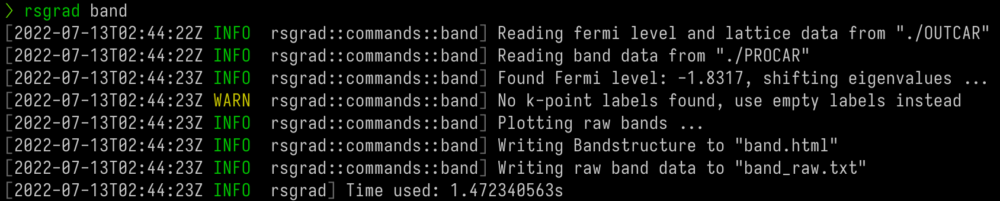
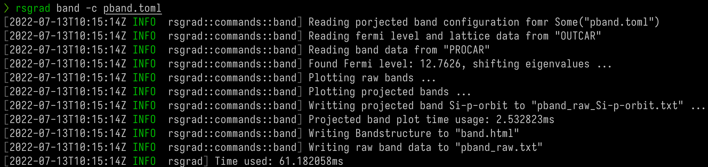

# Band Structure

`rsgrad band` can plot the band structure from _PROCAR_ and _OUTCAR_.

{{#include ./Band-example-SiDFT.html}}

## Help Message
```shell
$ rsgrad band -h
rsgrad-band
Plot bandstructure and projected bandstructure

USAGE:
    rsgrad band [OPTIONS]

OPTIONS:
    -c, --config <CONFIG>
            Band structure plot configuration file path

        --colormap <COLORMAP>
            [default: jet]

        --efermi <EFERMI>
            Set the E-fermi given from SCF's OUTCAR and it will be the reference energy level

        --gen-template
            Generate band structure plot configuration template

    -h, --help
            Print help information

        --htmlout <HTMLOUT>
            Save the band structure plot as HTML [default: band.html]

    -k, --kpoint-labels <KPOINT_LABELS>
            Symbols for high symmetry points on the kpoint path

        --ncl-spinor <NCL_SPINOR>
            [possible values: X, Y, Z]

        --outcar <OUTCAR>
            OUTCAR path [default: ./OUTCAR]

        --procar <PROCAR>
            PROCAR path [default: ./PROCAR]

        --show
            Open the browser and show the plot immediately

        --to-inline-html
            Render the plot and print the rendered code to stdout

        --txtout-prefix <TXTOUT_PREFIX>
            Save the raw data of band structure [default: band_raw]

        --ylim <YLIM> <YLIM>
            Set the y-range of the plot [default: "-1 6"]
```

## Configuration Template

```toml
{{#include ./pband_template.toml}}
```

## Example (without configuration file)

Simply run `rsgrad band` can plot the band structure. 



There may be a warning reminds you provide the labels of each high-symmetry point.  
`rsgrad` identifies high-symmetry points by calculate the difference of consecutive k-points.
If the difference equals zero, these two points are labelled as one high-symmetry point.  

For example:
```
...
k-point    38 :       0.0000    0.0256    0.0000
k-point    39 :       0.0000    0.0128    0.0000
k-point    40 :       0.0000    0.0000    0.0000
k-point    41 :       0.0000    0.0000    0.0000
k-point    42 :      -0.0085    0.0171    0.0000
k-point    43 :      -0.0171    0.0342    0.0000
...
```
_k-point 40_ and _k-point 41_ are same, thus be identified as one high-symmetry point. Each of the high-symmetry
points need a label. You may either left the `--kpoint-labels` empty or provide the correct labels seperated
by white spaces. Sometimes it may produce wrong band structure due to the special k-point path like

```
kpoints for bandstructure L-G-X-U K-G
 10
line
reciprocal
  0.50000  0.50000  0.50000    1
  0.00000  0.00000  0.00000    1

  0.00000  0.00000  0.00000    1
  0.00000  0.50000  0.50000    1

  0.00000  0.50000  0.50000    1
  0.25000  0.62500  0.62500    1

  0.37500  0.7500   0.37500    1
  0.00000  0.00000  0.00000    1
```

The end of third segment (0.25000, 0.62500, 0.62500) and the beginning of fourth segment (0.37500, 0.7500, 0.37500) 
are not consistent, which produces wrong k-path, leading to wrong band structure:

{{#include ./Band-example-SiDFT0.html}}

To solve this issue, you need to try the configuration file.

## Example (with configuration file)

With the configuration in the following

```toml
{{#include ./Band-example-pband.toml}}
```

and run `rsgrad -c pband.toml`



then it produces

{{#include ./Band-example-SiDFT1.html}}

## Example (for non-collinear system)

For the results produced by `vasp_ncl`, `rsgrad` supports plotting the \\(z\\) (\\(x\\) and \\(y\\) are also OK) projection to
analyze the spin angular moments.

```
{{#include ./Band-example-ncl.toml}}
```

then it produces

{{#include ./Band-example-ncl.html}}
