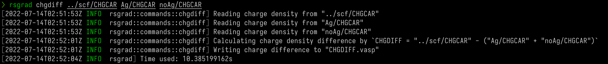
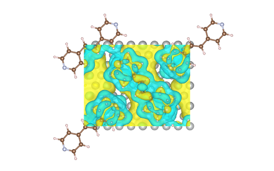

# Charge Density Difference

`rsgrad chgdiff` can calculate the charge density difference from _CHGCAR_ files:

$$
\Delta \rho = \rho_{A+B} - (\rho_A + \rho_B)
$$

Where \\(\rho_{A+B}\\), \\(\rho_A\\) and \\(\rho_B\\) are the charge densities of total structure,
A structure and B structure, respectively.

You may also need `rsgrad poscar --split ...` to generate
the structure of A and B from A+B.

## Help message

```shell
$ rsgrad chgdiff --help
rsgrad-chgdiff
Calculate charge density difference.

The operation is performed by `chgdiff = chgcar_ab - (chgcar_a + chgcar_b)`.

USAGE:
    rsgrad chgdiff [OPTIONS] <CHGCAR_AB> <CHGCAR_A> <CHGCAR_B>

ARGS:
    <CHGCAR_AB>
            The CHGCAR of A+B system

    <CHGCAR_A>
            The CHGCAR of A system

    <CHGCAR_B>
            The CHGCAR of B system

OPTIONS:
    -h, --help
            Print help information

    -o, --output <OUTPUT>
            The output charge density difference file path

            [default: CHGDIFF.vasp]
```

## Example

You need to calculate the electronic structure of the three structures (A+B, A and B) first,
then `rsgrad chgdiff CHGCAR_A+B CHGCAR_A CHGCAR_B` like



finally use _VESTA_ to visualize the data


