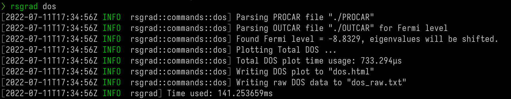
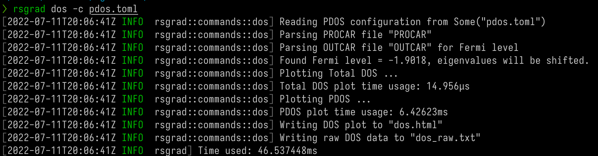

# Density of States

The `rsgrad dos` command calculates the Density of States (DOS) of current system.

{{#include ./dos-example-pdos-inline.html}}

`rsgrad` __DOES NOT__ read the _DOSCAR_, but calculates the DOS from _PROCAR_ instead by

$$
D(E) = \frac{1}{V} \sum_{i=1}^{N} \delta(E-E(\mathbf{k}_i))
$$

Because `rsgrad` uses arbitrary unit, the factor \\(\frac{1}{V}\\) is omitted. The \\(\delta(x)\\)
is replaced by Gaussian function or Lorentzian function:

$$
g(x) = \frac{1}{\sigma\sqrt{2\pi}} \exp \left( -\frac{1}{2} \frac{(x-\mu)^2}{\sigma^2} \right) \\\\
l(x) = \frac{1}{\pi} \frac{\sigma}{(x-\mu)^2 + \sigma^2}
$$

where \\(\mu\\) is \\(E(\mathbf{k}_i)\\) and \\(\sigma\\) is `sigma` of configuration in the implementation.

This method makes it easier to calculate projected DOS with projection of specific atoms, angular moments and k-points.
However, this method sometimes differs from _DOSCAR_ with `ISMEAR = 5`. For detailed explaination, see the 
[document here](https://docs.quantumatk.com/manual/technicalnotes/occupation_methods/occupation_methods.html).


__The _OUTCAR_ is also needed to get the Fermi level.__

## Help Message
```shell
$ rsgrad dos -h
rsgrad-dos
Calculate density of states from PROCAR and OUTCAR

USAGE:
    rsgrad dos [OPTIONS]

OPTIONS:
    -c, --config <CONFIG>       Projected DOS configuration file path
        --gen-template          Generate projected DOS configuration template
    -h, --help                  Print help information
        --htmlout <HTMLOUT>     Save the projected DOS plot as HTML. Then you can view it in the
                                browser [default: dos.html]
        --outcar <OUTCAR>       OUTCAR path [default: ./OUTCAR]
        --procar <PROCAR>       PROCAR path [default: ./PROCAR]
        --show                  Open the browser and show the plot immediately
        --show-brief            Print brief info of PROCAR, this may be helpful when you write the
                                configuration
        --to-inline-html        Render the plot and print the rendered code to stdout
        --txtout <TXTOUT>       Save the raw data of projected DOS. Then you can replot it with more
                                advanced tools [default: dos_raw.txt]
        --xlim <XLIM> <XLIM>    Set the x-range of the plot [default: -1 6]
```

## Configuration Template

The configuration template can be generated by running `rsgrad dos --gen-template`. The following configuration
is written to `pband.toml` by default:

```toml
{{#include ../../src/commands/pdos_template.toml}}
```

<!--<script src="https://cdn.plot.ly/plotly-2.12.1.min.js"></script>-->

## Example (without configuration file)

This command can calculate total DOS only. To calculate projected DOS,
use configuration instead (see next section).



The output html should be like something in the following

{{#include ./dos-example-inline.html}}

## Example (with configuration file)

To plot multiple PDOS, using configuration file is suggested.

With the configuration (`pdos.toml`) in the following

```toml
method      = "Gaussian"
sigma       = 0.05
procar      = "PROCAR"
outcar      = "OUTCAR"
txtout      = "dos_raw.txt"
htmlout     = "dos.html"
totdos      = true
fill        = true
xlim        = [-1, 6]

[pdos.Benzene]
atoms   = "37..48"

[pdos.AgSurf]
atoms   = "3 6 10 14 21 23 25 33 36"
```
then `rsgrad dos -c pdos.toml`



you will get something in the following

{{#include ./dos-example-pdos-inline2.html}}


## Usage of _txtout_

`rsgrad` can write the raw data of plot by setting _txtout_ (`dos_raw.txt` by default). The organization of it
shows the energy, total DOS and projected dos respectively:

```
{{#include ./dos-example-raw.txt:1}}
...
{{#include ./dos-example-raw.txt:527:547}}
...
```

The first line shows the labels of each series and have a hastag `#` in the beginning in order to let `numpy.loadtxt`
can read it directly.

Then you can throw it into other plotters like Excel, Matplotlib, OriginPro GnuPlot etc. and do whatever fancy things you prefer.
