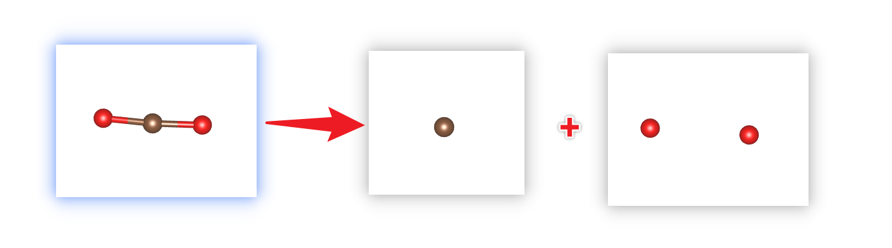

# POSCAR

There are several operations that `rsgrad pos` can do

- Convert the fractional coordinates to Cartesian coordinates or convert reversely;
- Split the _POSCAR_ and save the two parts;  
_This command is useful when you want to calculate charge density difference and adsorption energy_.
- Format the _POSCAR_ and add element symbol tags to each atom.

## Help Message
```shell
$ rsgrad pos --help
rsgrad-pos 
Operation(s) about POSCAR, including split it into two POSCARs

USAGE:
    rsgrad pos [OPTIONS] [--] [POSCAR]

ARGS:
    <POSCAR>
            Specify the input POSCAR file
            
            [default: ./POSCAR]

OPTIONS:
    -a, --a-name <A_NAME>
            Splitted POSCAR path with selected atoms
            
            [default: POSCAR_A]

    -b, --b-name <B_NAME>
            Splitted POSCAR path with complement of `a_name`
            
            [default: POSCAR_B]

    -c, --cartesian
            Cartesian coordinates is used in writting POSCAR

        --convert
            Convert POSCAR to cartesian coordinates or fractional coordinates

        --converted <CONVERTED>
            The target path of converted POSCAR
            
            [default: POSCAR_new]

    -h, --help
            Print help information

    -i, --select-indices <SELECT_INDICES>...
            Selects the indices to operate.
            
            Step indices start from '1', if '0' is given, all the structures will be selected. Step
            indices can be negative, where negative index means counting reversely. E.g. "-i -2 -1 1
            2 3" means selecting the last two and the first three atom.

        --no-add-symbols-tags
            The symbols of each atom will not be written as comment in POSCAR

        --no-preserve-constraints
            Atom constraints will be dropped when writting POSCAR

    -s, --split
            Split POSCAR according to selected_indices
```

## Examples

- Format the _POSCAR_ to add element symbol tags

The original _POSCAR_ of CO<sub>2</sub>:
```
 C  O 
 1.0000000000000000
    20.0000000000000000    0.0000000000000000    0.0000000000000000
     0.0000000000000000   20.0000000000000000    0.0000000000000000
     0.0000000000000000    0.0000000000000000   20.0000000000000000
 C   O  
   1   2
Direct
  0.5000000000000000  0.5000000000000000 -0.5000000000000000
  0.5754584707965210  0.4974961803083730  0.5000000000000000
  0.4249089651951450  0.5078477015701101  0.5000000000000000
```

Then run `rsgrad pos POSCAR --convert`

```shell
$ rsgrad pos POSCAR --convert
[2022-07-14T15:38:47Z INFO  rsgrad::commands::pos] Reading POSCAR file "POSCAR" ...
[2022-07-14T15:38:47Z INFO  rsgrad::commands::pos] Converting it to "POSCAR_new"
[2022-07-14T15:38:47Z INFO  rsgrad::commands::pos] Done
[2022-07-14T15:38:47Z INFO  rsgrad] Time used: 1.96796ms
```

The formatted file should be _POSCAR_new_

```
C  O
 1.0000000
      20.000000000       0.000000000       0.000000000
       0.000000000      20.000000000       0.000000000
       0.000000000       0.000000000      20.000000000
      C      O
      1      2
Direct
      0.5000000000      0.5000000000     -0.5000000000 !      C-001    1
      0.5754584708      0.4974961803      0.5000000000 !      O-001    2
      0.4249089652      0.5078477016      0.5000000000 !      O-002    3
```

- Convert _POSCAR_ to Cartesian coordinates

Just run `rsgrad pos POSCAR --convert --cartesian`

```shell
$ rsgrad pos POSCAR --convert --cartesian
[2022-07-14T15:40:33Z INFO  rsgrad::commands::pos] Reading POSCAR file "POSCAR" ...
[2022-07-14T15:40:33Z INFO  rsgrad::commands::pos] Converting it to "POSCAR_new"
[2022-07-14T15:40:33Z INFO  rsgrad::commands::pos] Done
[2022-07-14T15:40:33Z INFO  rsgrad] Time used: 1.57861ms
```

The converted file _POSCAR_new_ should be like

```
C  O
 1.0000000
      20.000000000       0.000000000       0.000000000
       0.000000000      20.000000000       0.000000000
       0.000000000       0.000000000      20.000000000
      C      O
      1      2
Cartesian
     10.0000000000     10.0000000000    -10.0000000000 !      C-001    1
     11.5091694159      9.9499236062     10.0000000000 !      O-001    2
      8.4981793039     10.1569540314     10.0000000000 !      O-002    3
```

- Split the _POSCAR_

Let take the CO<sub>2</sub> structure as the example again. Here we will take the
C atom out to see what the operation does.

The C atom index is `1`, so we should run `rsgrad pos POSCAR -s -i 1`

```shell
$ rsgrad pos POSCAR -s -i 1
[2022-07-14T15:49:32Z INFO  rsgrad::commands::pos] Reading POSCAR file "POSCAR" ...
[2022-07-14T15:49:32Z INFO  rsgrad::commands::pos] Splitting it to "POSCAR_A" and "POSCAR_B" ...
[2022-07-14T15:49:32Z INFO  rsgrad::commands::pos] "POSCAR_A" contains
[2022-07-14T15:49:32Z INFO  rsgrad::commands::pos]       C     1
[2022-07-14T15:49:32Z INFO  rsgrad::commands::pos] "POSCAR_B" contains
[2022-07-14T15:49:32Z INFO  rsgrad::commands::pos]       O     2
[2022-07-14T15:49:32Z INFO  rsgrad::commands::pos] "POSCAR_A" written
[2022-07-14T15:49:32Z INFO  rsgrad::commands::pos] "POSCAR_B" written
[2022-07-14T15:49:32Z INFO  rsgrad] Time used: 2.11275ms
```

The separated files should be like

```shell
$ bat POSCAR_A POSCAR_B
───────┬──────────────────────────────────────────────────────────────────────────
       │ File: POSCAR_A
───────┼──────────────────────────────────────────────────────────────────────────
   1   │ Generated by rsgrad, POSCAR with selected atoms
   2   │  1.0000000
   3   │       20.000000000       0.000000000       0.000000000
   4   │        0.000000000      20.000000000       0.000000000
   5   │        0.000000000       0.000000000      20.000000000
   6   │       C
   7   │       1
   8   │ Direct
   9   │       0.5000000000      0.5000000000     -0.5000000000 !      C-001    1
───────┴──────────────────────────────────────────────────────────────────────────
───────┬──────────────────────────────────────────────────────────────────────────
       │ File: POSCAR_B
───────┼──────────────────────────────────────────────────────────────────────────
   1   │ Generated by rsgrad, POSCAR complement
   2   │  1.0000000
   3   │       20.000000000       0.000000000       0.000000000
   4   │        0.000000000      20.000000000       0.000000000
   5   │        0.000000000       0.000000000      20.000000000
   6   │       O
   7   │       2
   8   │ Direct
   9   │       0.5754584708      0.4974961803      0.5000000000 !      O-001    1
  10   │       0.4249089652      0.5078477016      0.5000000000 !      O-002    2
───────┴──────────────────────────────────────────────────────────────────────────
```

The process schema:


