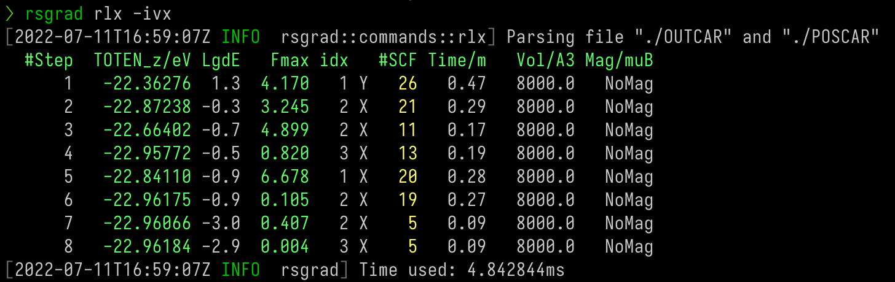

# Relaxation

To track the relaxation or MD process, use `rsgrad rlx`. This command is useful if you want to know the progress
of geometry optimization (aka _relaxation_) or molecular dynamics.

This commands extract the following tags from `OUTCAR`:
- TOTEN
- TOTEN without entropy
- TOTEN difference between two ionic steps
- Maximum of atom forces (The negative _EDIFFG_ is the threshold of this tag)
- The index of the atom with the maximum of force
- Number of SCF steps of each ionic step
- Time usage of each ionic step
- Volume of the cell
- Total magnetic moment

## Help Message

```shell
$ rsgrad rlx -h
rsgrad-rlx
Tracking relaxation or MD progress

USAGE:
    rsgrad rlx [OPTIONS] [OUTCAR]

ARGS:
    <OUTCAR>    Specify the input OUTCAR file [default: ./OUTCAR]

OPTIONS:
    -a, --favg               Prints averaged total force in eV/A
    -e, --toten              Prints TOTEN in eV
    -h, --help               Print help information
    -i, --fmidx              Prints the index of ion with maximum total force load. Starts from 1
        --no-fmax            Don't print maximum total force in A^3
        --no-lgde            Don't print Log10(delta(TOTEN without entropy))
        --no-magmom          Don't print total magnetic moment in muB
        --no-nscf            Don't print number of SCF iteration for each ionic step
        --no-time            Don't print time elapsed for each ionic step in minutes
        --no-totenz          Don't print TOTEN without entropy in eV
    -p, --poscar <POSCAR>    Specify the input POSCAR file [default: ./POSCAR]
    -v, --volume             Prints lattice volume in A^3
    -x, --fmaxis             Prints the axis where the strongest total force component lies on.
                             [XYZ]
```

## Example


