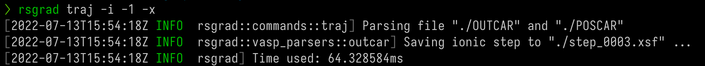
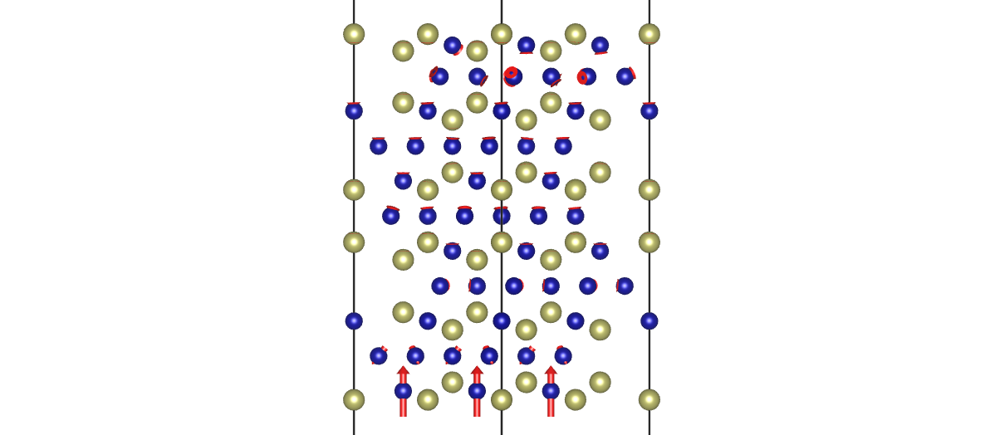
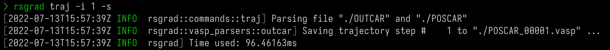

# Trajectory

`rsgrad` reads _OUTCAR_ then provide some operations in the following.

- Save selected steps as _XDATCAR_.
- Save selected steps as _POSCAR_ files.
- Save selected steps as _XSF_ files. With _XSF_, _VESTA_ can show the force vectors on every atom.

## Help Message

```
rsgrad-traj
Operations about relaxation/MD trajectory.

POSCAR is needed if you want to preserve the constraints when saving frames to POSCAR.

USAGE:
    rsgrad traj [OPTIONS] [--] [OUTCAR]

ARGS:
    <OUTCAR>
            Specify the input OUTCAR file

            [default: ./OUTCAR]

OPTIONS:
        --cartesian
            Save to POSCAR in cartesian coordinates, the coordinates written is direct/fractional by
            default

    -d, --save-as-xdatcar
            Save whole trajectory in XDATCAR format

    -h, --help
            Print help information

    -i, --select-indices <SELECT_INDICES>...
            Selects the indices to operate.

            Step indices start from '1', if '0' is given, all the structures will be selected. Step
            indices can be negative, where negative index means counting reversely. E.g.
            "-i -2 -1 1 2 3" means selecting the last two and first three steps.

        --no-add-symbol-tags
            Don't add chemical symbol to each line of coordinates

        --no-preserve-constraints
            Don't preverse constraints when saving trajectory to POSCAR

    -p, --poscar <POSCAR>
            Specify the input POSCAR file

            [default: ./POSCAR]

    -s, --save-as-poscar
            Save selected steps as POSCARs

        --save-in <SAVE_IN>
            Define where the files would be saved

            [default: .]

    -x, --save-as-xsfs
            Saves each selected modes to XSF file, this file includes each atom's force information
```

## Examples

- Take the last step and save as _XSF_ file  
`rsgrad traj -i -1 -x`



- Take the first step and save as _POSCAR_ file  
`rsgrad traj -i 0 -p`

