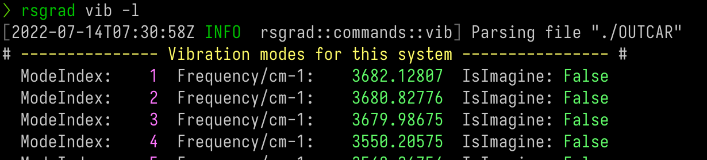
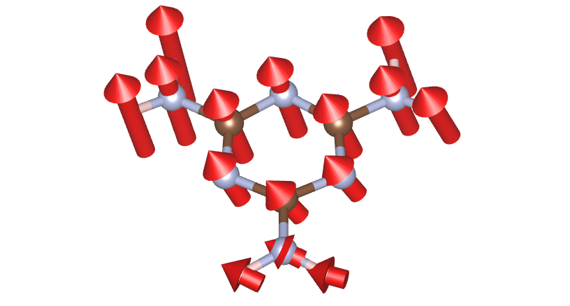

# Vibration

For systems enabled vibration calculation (phonon at Γ point only), `rsgrad vib` can
- Print the phonon eigenvalues;
- Save the phonon eigenvectors;
- Modulate the ground-state according to specified modes.

## Help Message

```shell
$ rsgrad vib --help
rsgrad-vib
Tracking vibration information.

For systems enabled vibration mode calculation, this command can extract phonon eigenvalues and
phonon eigenvectors at Gamma point.

USAGE:
    rsgrad vib [OPTIONS] [--] [OUTCAR]

ARGS:
    <OUTCAR>
            Specify the input OUTCAR file

            [default: ./OUTCAR]

OPTIONS:
    -a, --amplitude <AMPLITUDE>
            Modulation amplitude coefficient, to avoid precision issue, abs(amplitude) >= 0.01
            should be satisfied

            [default: 0.1]

    -c, --cartesian
            Catesian coordinate is used when writting POSCAR. Fractional coordinate is used by
            default

    -h, --help
            Print help information

    -i, --select-indices <SELECT_INDICES>...
            Selects the mode indices to operate.

            Step indices start from '1', if '0' is given, all the structures will be selected. Step
            indices can be negative, where negative index means counting reversely. E.g. "-i -2 -1 1
            2 3" means selecting the last two and first three steps.

    -l, --list
            Shows vibration modes in brief

    -m, --modulate
            Modulate the ground-state POSCAR with respect to a certern vibration frequencies

    -p, --poscar <POSCAR>
            Specify the input POSCAR file, the consntraints info is needed

            [default: ./POSCAR]

        --save-in <SAVE_IN>
            Define where the files would be saved

            [default: .]

    -x, --save-as-xsfs
            Saves each selected modes to XSF file
```

## Example

- Print the phonon eigenvalues;


- Save the phonon eigenvectors;
```shell
$ rsgrad vib -i {1..3} {-3..-1} -x
[2022-07-14T18:32:49Z INFO  rsgrad::commands::vib] Parsing file "./OUTCAR"
[2022-07-14T18:32:49Z INFO  rsgrad::vasp_parsers::outcar] Saving mode #   1 as "./mode_0001_3682.13cm-1.xsf" ...
[2022-07-14T18:32:49Z INFO  rsgrad::vasp_parsers::outcar] Saving mode #   3 as "./mode_0003_3679.99cm-1.xsf" ...
[2022-07-14T18:32:49Z INFO  rsgrad::vasp_parsers::outcar] Saving mode #  44 as "./mode_0044_0010.79cm-1_imag.xsf" ...
[2022-07-14T18:32:49Z INFO  rsgrad::vasp_parsers::outcar] Saving mode #  43 as "./mode_0043_0007.12cm-1_imag.xsf" ...
[2022-07-14T18:32:49Z INFO  rsgrad::vasp_parsers::outcar] Saving mode #   2 as "./mode_0002_3680.83cm-1.xsf" ...
[2022-07-14T18:32:49Z INFO  rsgrad::vasp_parsers::outcar] Saving mode #  45 as "./mode_0045_0047.20cm-1_imag.xsf" ...
[2022-07-14T18:32:49Z INFO  rsgrad] Time used: 109.566967ms
```


- Modulate the ground-state according to specified modes.
```shell
$ rsgrad vib -i {-3..-1} --modulate --amplitude 0.1
[2022-07-14T18:31:41Z INFO  rsgrad::commands::vib] Parsing file "./OUTCAR"
[2022-07-14T18:31:41Z INFO  rsgrad::vasp_parsers::outcar] Saving modulated POSCAR of mode #  43 with amplitude coeff 0.100 as "./mode_0043_0007.12cm-1_0.100_imag.vasp" ...
[2022-07-14T18:31:41Z INFO  rsgrad::vasp_parsers::outcar] Saving modulated POSCAR of mode #  44 with amplitude coeff 0.100 as "./mode_0044_0010.79cm-1_0.100_imag.vasp" ...
[2022-07-14T18:31:41Z INFO  rsgrad::vasp_parsers::outcar] Saving modulated POSCAR of mode #  45 with amplitude coeff 0.100 as "./mode_0045_0047.20cm-1_0.100_imag.vasp" ...
[2022-07-14T18:31:41Z INFO  rsgrad] Time used: 202.629805ms
```
