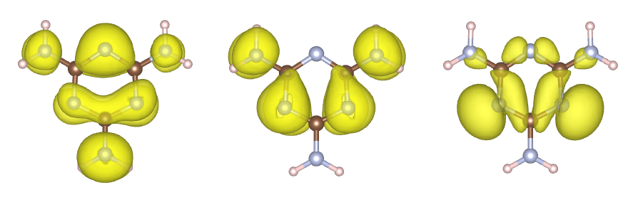

# Wavefunction 3D

Main functions of `rsgrad wav3d`
- List the brief information of _WAVECAR_;
- Save the selected wavefunction to _.vasp_ file.

## Help Message

```shell
$ rsgrad wav3d --help
rsgrad-wav3d
Plot wavefunction in realspace, and save it as '.vasp' file

USAGE:
    rsgrad wav3d [OPTIONS]

OPTIONS:
    -b, --ibands <IBANDS>...
            Select band index, starting from 1

    -d, --detail
            Show the eigen values and band occupations of current WAVECAR.

            This flag should be used with `--list`

    -e, --show-eigs-suffix
            Add eigen value suffix to the filename

        --gamma-half <GAMMA_HALF>
            Gamma Half direction of WAVECAR. You need to set this to 'x' or 'z' when processing
            WAVECAR produced by `vasp_gam`

            [possible values: x, z]

    -h, --help
            Print help information

    -k, --ikpoints <IKPOINTS>...
            Select kpoint index, starting from 1

            [default: 1]

    -l, --list
            List the brief info of current WAVECAR

    -o, --output-parts <OUTPUT_PARTS>...
            Specify output part of the wavefunction.

            Detailed message:
             - normsquared/ns: Perform `ρ(r) = |ѱ(r)|^2` action to get the spatial distribution of
            selected band.
             - real/re: Real part of the wavefunction, suffix '_re.vasp' is added to the output
            filename.
             - imag/im: Imaginary part of the wavefunction, suffix '_im.vasp' is added to the output
            filename.
             - reim: Output both real part and imaginary parts of the wavefunction.

            [possible values: normsquared, ns, real, re, imag, im, reim]

    -p, --poscar <POSCAR>
            POSCAR filename, POSCAR is needed to get the real-space wavefunction

            [default: ./POSCAR]

        --prefix <PREFIX>
            Prefix of output filename

            [default: wav]

    -s, --ispins <ISPINS>...
            Select spin index, starting from 1

            [default: 1]

    -w, --wavecar <WAVECAR>
            WAVECAR file name

            [default: ./WAVECAR]
```

## Example

- List the brief information of _WAVECAR_

```shell
$ rsgrad wav3d -l

[2022-07-14T09:19:51Z INFO  rsgrad::commands::wav3d] Reading WAVECAR: "./WAVECAR"
LENGTH     =             54145104
RECLEN     =              1388336
TYPE       =             Standard
NSPIN      =                    1
NKPTS      =                    1
NBANDS     =                   36
ENCUT      =              450.000
EFERMI     =               -5.368
VOLUME     =             8000.000
NGRID      = [  71,   71,   71]
NPLWS      = [173541]
ACELL      = [[  20.000,    0.000,    0.000], [   0.000,   20.000,    0.000], [   0.000,    0.000,   20.000]]
BCELL      = [[   0.050,    0.000,    0.000], [   0.000,    0.050,    0.000], [   0.000,    0.000,    0.050]]


[2022-07-14T09:19:51Z INFO  rsgrad] Time used: 160.337862ms
```

if you want the band eigen values information

```shell
$ rsgrad wav3d -ld

...
<BRIEF INFORMATION ABOUT WAVECAR>
...

ISPIN:  1  IKPOINT:    1  IBAND:     1 E-Efermi:    -19.991 Occupation: 1.000
ISPIN:  1  IKPOINT:    1  IBAND:     2 E-Efermi:    -18.141 Occupation: 1.000
ISPIN:  1  IKPOINT:    1  IBAND:     3 E-Efermi:    -18.141 Occupation: 1.000
ISPIN:  1  IKPOINT:    1  IBAND:     4 E-Efermi:    -16.418 Occupation: 1.000
ISPIN:  1  IKPOINT:    1  IBAND:     5 E-Efermi:    -15.534 Occupation: 1.000
ISPIN:  1  IKPOINT:    1  IBAND:     6 E-Efermi:    -15.532 Occupation: 1.000
ISPIN:  1  IKPOINT:    1  IBAND:     7 E-Efermi:    -10.662 Occupation: 1.000
ISPIN:  1  IKPOINT:    1  IBAND:     8 E-Efermi:    -10.661 Occupation: 1.000
...
```

- Save the selected wavefunction to _.vasp_ file
```shell
$ rsgrad wav3d -b {10..20} -o ns -e

[2022-07-14T09:23:06Z INFO  rsgrad::commands::wav3d] Reading WAVECAR: "./WAVECAR"
[2022-07-14T09:23:06Z INFO  rsgrad::commands::wav3d] Reading POSCAR: "./POSCAR"
[2022-07-14T09:23:06Z INFO  rsgrad::commands::wav3d] Processing spin 1, k-point   1, band   10 ...
[2022-07-14T09:23:06Z INFO  rsgrad::commands::wav3d] Processing spin 1, k-point   1, band   13 ...
[2022-07-14T09:23:06Z INFO  rsgrad::commands::wav3d] Processing spin 1, k-point   1, band   11 ...
[2022-07-14T09:23:06Z INFO  rsgrad::commands::wav3d] Processing spin 1, k-point   1, band   14 ...
[2022-07-14T09:23:06Z INFO  rsgrad::commands::wav3d] Processing spin 1, k-point   1, band   12 ...
[2022-07-14T09:23:06Z INFO  rsgrad::commands::wav3d] Processing spin 1, k-point   1, band   15 ...
[2022-07-14T09:23:06Z INFO  rsgrad::commands::wav3d] Writing "wav_1-1-13_-5.740eV.vasp" ...
[2022-07-14T09:23:06Z INFO  rsgrad::commands::wav3d] Writing "wav_1-1-15_-5.601eV.vasp" ...
[2022-07-14T09:23:06Z INFO  rsgrad::commands::wav3d] Writing "wav_1-1-14_-5.728eV.vasp" ...
[2022-07-14T09:23:06Z INFO  rsgrad::commands::wav3d] Writing "wav_1-1-10_-8.376eV.vasp" ...
[2022-07-14T09:23:06Z INFO  rsgrad::commands::wav3d] Writing "wav_1-1-11_-7.385eV.vasp" ...
[2022-07-14T09:23:06Z INFO  rsgrad::commands::wav3d] Writing "wav_1-1-12_-7.380eV.vasp" ...
[2022-07-14T09:23:08Z INFO  rsgrad::commands::wav3d] Processing spin 1, k-point   1, band   18 ...
[2022-07-14T09:23:08Z INFO  rsgrad::commands::wav3d] Processing spin 1, k-point   1, band   19 ...
[2022-07-14T09:23:09Z INFO  rsgrad::commands::wav3d] Writing "wav_1-1-18_-3.514eV.vasp" ...
[2022-07-14T09:23:09Z INFO  rsgrad::commands::wav3d] Processing spin 1, k-point   1, band   16 ...
[2022-07-14T09:23:09Z INFO  rsgrad::commands::wav3d] Processing spin 1, k-point   1, band   20 ...
[2022-07-14T09:23:09Z INFO  rsgrad::commands::wav3d] Writing "wav_1-1-19_-3.265eV.vasp" ...
[2022-07-14T09:23:09Z INFO  rsgrad::commands::wav3d] Processing spin 1, k-point   1, band   17 ...
[2022-07-14T09:23:10Z INFO  rsgrad::commands::wav3d] Writing "wav_1-1-16_-5.477eV.vasp" ...
[2022-07-14T09:23:10Z INFO  rsgrad::commands::wav3d] Writing "wav_1-1-17_-3.546eV.vasp" ...
[2022-07-14T09:23:10Z INFO  rsgrad::commands::wav3d] Writing "wav_1-1-20_-0.701eV.vasp" ...
[2022-07-14T09:23:11Z INFO  rsgrad] Time used: 5.484733549s
```

Open the _.vasp_ in _VESTA_



__`rsgrad wav3d` supports extracting multiple bands at the same time, and the processes
executed in parallel, which can save a lot of time.__
